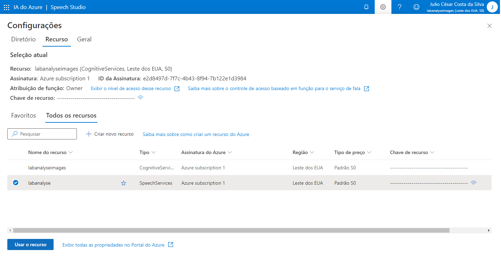

Conversão de fala em texto

1 - Acessar o link: https://speech.microsoft.com/portal. Ir em configurações e selecionar um recusrso, caso não tenha nenhum, criar um novo recurso. Excolher o recusro desejado e selecionar a opção Usar o recurso.

2 - Selecionar a opção Conversão de fala em texto em tempo real

3 - Selecionar um o arquivo desejado. Em Resultados de teste, aparece o texto do áudio e o JSON.

Language Service

1 - Acessar https://portal.azure.com/, selecionar a opção Create resource, depois a opção AI + Machine Learning, em seguida a opção Create em Language Service.

2 - Selecionar a opção Continue to create your resource.

3 - Configurar as opções e selecionar Review + create

4 - Após a validação, selecionar a opção Create

5 - Acessar o link https://language.cognitive.azure.com/home e configurar as opções:

6 - Selecionar a opção Analyze sentment and mine opnions, em Classify text

7 - Selecionar o idioma e inserir o texto desejado.

8 - Rodar a aplicação e abaixo serão exibidos os resultados e o arquivo JSON.

